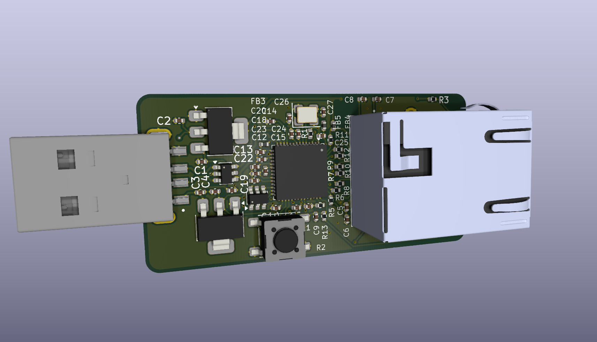
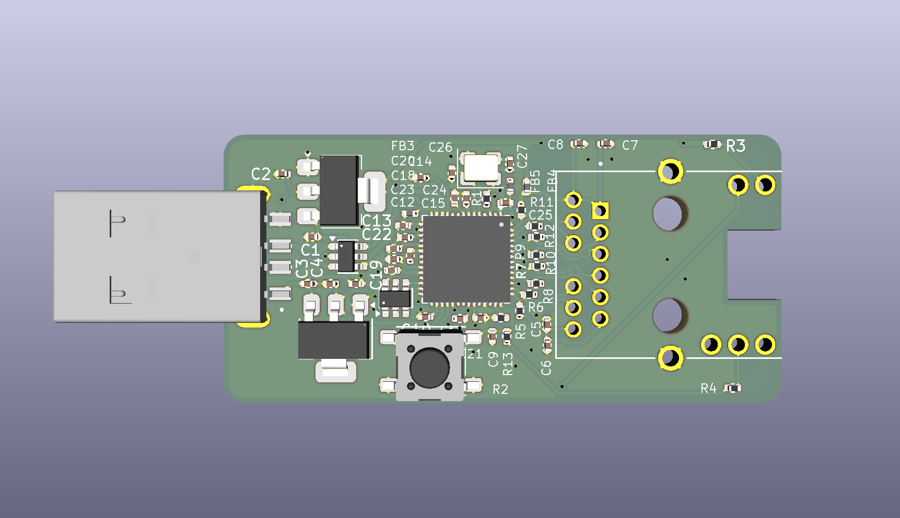
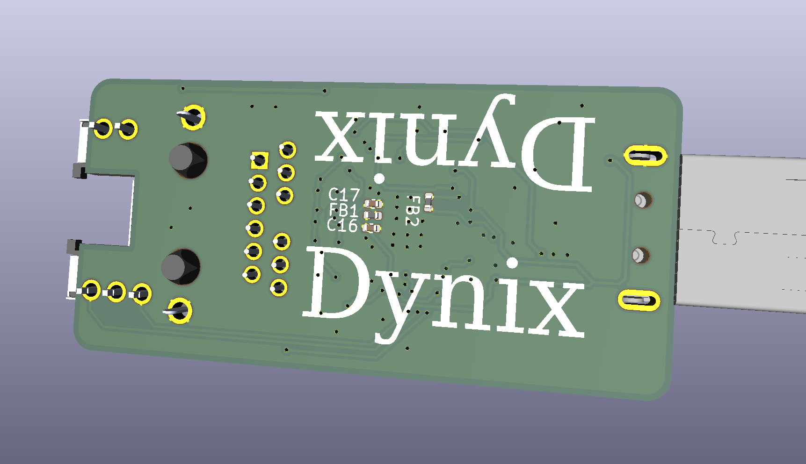

# USBToEthernet
This is a design for USB to Ethernet Adapter that (obviously) allows you to use ethernet through a USB port.

# Why I Made It
I made this PCB because I was getting into setting up some sort of homeserver using my old laptop. However, my laptop doesn't have an ethernet port and while I could use WIFI, it wouldn't be optimal for network speed.

# Picture

# BOM

|Name                      |Purpose                       |Quantity|Total Cost (USD)|Link                                                                                                                                                                             |Distributor|
|--------------------------|------------------------------|--------|----------------|---------------------------------------------------------------------------------------------------------------------------------------------------------------------------------|-----------|
|10k Resistor              |Resistor                      |        |0.06            |https://www.lcsc.com/product-detail/C2906861.html|LCSC       |
|8.06k Resistor            |Resistor                      |        |0.01            |https://www.lcsc.com/product-detail/C2960789.html|LCSC       |
|12k Resistor              |Resistor                      |        |0.06            |https://www.lcsc.com/product-detail/C2909316.html|LCSC       |
|1k Resistor               |Resistor                      |        |0.06            |https://www.lcsc.com/product-detail/C2906864.html|LCSC       |
|49.9 Capcitor             |Capacitor                     |        |0.06            |https://www.lcsc.com/product-detail/C2933103.html|LCSC       |
|24pF Capacitor            |Capacitor                     |        |0.12            |https://www.lcsc.com/product-detail/C281755.html |LCSC       |
|100nF Capacitor           |Decoupling Capacitor          |        |0.10            |https://www.lcsc.com/product-detail/C60474.html  |LCSC       |
|10uF Capacitor            |Capacitor                     |        |0.18            |https://www.lcsc.com/product-detail/C14445.html  |LCSC       |
|1uF Capacitor             |Capacitor                     |        |0.23            |https://www.lcsc.com/product-detail/C14445.html  |LCSC       |
|22nF Capacitor            |Capacitor                     |        |0.20            |https://www.lcsc.com/product-detail/C1532.html   |LCSC       |
|120 Ohm Ferrite Bead      |Power Filtering               |5       |0.90            |https://www.digikey.com/short/c9nm3n45                                                                                                                                           |Digikey    |
|USBLC6-2SC6               |Power Protection              |1       |0.36            |https://www.digikey.com/short/m59b7dzr                                                                                                                                           |Digikey    |
|NCP1117 Voltage Regulator |Voltage Regulator             |1       |0.38            |https://www.digikey.com/short/pvbpmpzr                                                                                                                                           |Digikey    |
|USB Plug                  |For Plugging Into Computer    |1       |1.35            |https://www.digikey.com/short/75mfb4tp                                                                                                                                           |Digikey    |
|PTS645S Push Button       |Reset Button                  |1       |0.36            |https://www.digikey.com/short/q00wnt84                                                                                                                                           |Digikey    |
|L836-1J1T-43 Ehternet Jack|Ethernet Jack                 |1       |6.53            |https://www.digikey.com/short/7bz57dt5                                                                                                                                           |Digikey    |
|AMS117 1.2V               |Voltage Regulator for LAN7500 |1       |0.10            |https://www.digikey.com/short/jqn99nv8                                                                                                                                           |Digikey    |
|93LC56AT-I/OT             |Storage                       |1       |0.32            |https://www.digikey.com/short/z01d9wp0                                                                                                                                           |Digikey    |
|TSX-3225 25Mhz Crystal    |Crystal Oscillator for LAN7500|1       |0.38            |https://www.digikey.com/short/hw0jtcmv                                                                                                                                           |Digikey    |
|LAN7500-ABZJ              |USB to Ethernet Chip          |1       |7.00            |https://www.digikey.com/short/8pjfdmbz                                                                                                                                           |Digikey    |
|Stencil                   |Stencil for Manually Assembly |1       |7.11            |                                                                                                                                                                                 |JLCPCB     |
|PCB                       |PCB for Build                 |5       |5.20            |                                                                                                                                                                                 |JLCPCB     |

